<div align="center">



<br/>

[](https://git.io/typing-svg)

<br/>

<a href="https://www.linkedin.com/in/nikhil-yadav-a4748b2a0/"></a>  <a href="mailto:nikhilmehta76765@gmail.com"></a>  <a href="https://github.com/Nikhilyadav18"></a>

</div>

<br/>

---

## `// 01 — FEATURED PROJECTS`

<table>
<tr>
<td width="50%" valign="top">

`> open langgraph_coding_assistant`

**Multi-Agent AI Coding Assistant** — stateful coding workflow for contextual code analysis, requirement understanding, file reading, dependency analysis, and intelligent response generation.

`LangGraph` `LangChain` `LLMs` `Multi-Agent Systems`

</td>
<td width="50%" valign="top">

`> open insurance_prediction_api`

**ML prediction API** — production-ready REST API for insurance premium category prediction with automated feature engineering, validation, documentation, and Docker deployment.

`Python` `FastAPI` `Scikit-learn` `Docker`

</td>
</tr>
<tr>
<td width="50%" valign="top">

`> open speech_disfluency_detection`

**Speech disfluency detection** — end-to-end ML pipeline using MFCCs, delta features, energy-based segmentation, custom labeling, preprocessing, and feature normalization.

`Python` `MFCC` `Machine Learning` `Speech Processing`

</td>
<td width="50%" valign="top">

`> open dog_vs_cat_classifier`

**Deep learning image classifier** — MobileNetV2 transfer-learning pipeline achieving **97.23% validation accuracy**, with interactive model inference.

`TensorFlow` `Keras` `OpenCV` `Streamlit`

</td>
</tr>
<tr>
<td width="50%" valign="top">

`> open ai_experiments`

**AI / ML experiments** — exploring machine learning, deep learning, NLP, LLM applications, RAG, and agentic workflows through practical implementations.

`PyTorch` `TensorFlow` `NLP` `LLMs` `RAG`

</td>
<td width="50%" valign="top">

<br/>

```text
> ls ./projects | wc -l
  more compiling...
  check pinned repos ↓
```

</td>
</tr>
</table>

---

## `// 02 — STACK`

```text
AI / ML        PyTorch · TensorFlow · Scikit-learn · NLP · OpenCV · NumPy · Pandas
LANGUAGES      Python · C++ · C · SQL
GEN AI         LLMs · RAG · Prompt Engineering · Generative AI
AGENTS         LangChain · LangGraph · Multi-Agent Systems · MCP AI · Agents
BACKEND        FastAPI · REST APIs · Docker · MySQL · MongoDB
ANALYTICS      Power BI · Matplotlib · Seaborn · Excel · Feature Engineering
RESEARCH       Speech Processing · Model Evaluation
```

---

## `// 03 — EXPERIENCE`

**`[RESEARCH]`**   Speech Disfluency Detection Project — **under Dr. Chandra Prakash**

* Developed an end-to-end speech disfluency detection pipeline using MFCCs, delta features, and energy-based segmentation
* Built a custom labeled dataset covering blocks, prolongations, and repetitions
* Implemented speech preprocessing and feature normalization
* Trained and evaluated classical ML and lightweight neural network models
* Initial classification accuracy: **50–55%**

---

## `// 04 — ACHIEVEMENTS`

| `status`  | `event`                             | `detail`                                     |
| --------- | ----------------------------------- | -------------------------------------------- |
| `[AIR]`   | **NACAT 2025**                      | AIR 680 — National Career Aptitude Test      |
| `[CERT]`  | **Machine Learning Specialization** | Coursera — Andrew Ng, Stanford University    |
| `[SPORT]` | **Inter-NIT Ball Badminton**        | Represented SVNIT in competitive tournaments |


---


**Want to see what I'm building?**

<a href="https://github.com/Nikhilyadav18">


</a>

<br/><br/>

*Machine Learning · Deep Learning · LLMs · RAG · Agentic AI*

<br/>

`EOF // Nikhilyadav18 // Build · Research · Experiment · Deploy`

</div>
